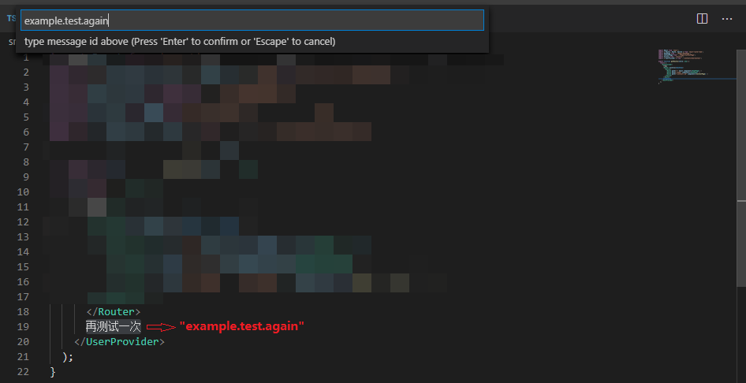
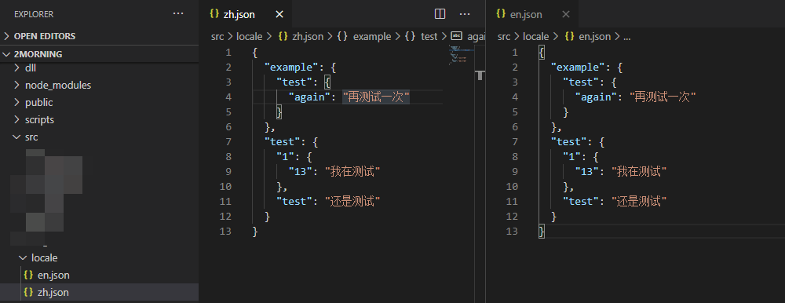
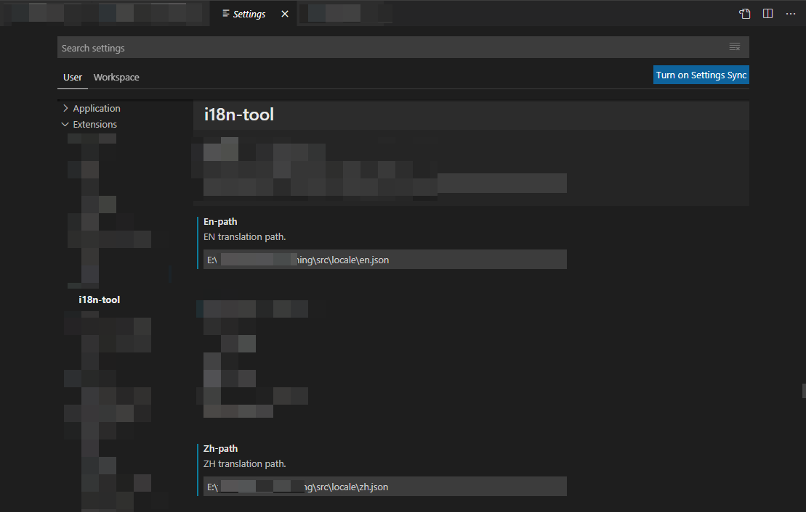

# i18n-tool README

This is a tool to help you find Chinese words, and create translation messages automatically.

## Features

Describe specific features of your extension including screenshots of your extension in action. Image paths are relative to this README file.

### Highlight chinese words in text editor (ctrl+shift+F / ctrl+shift+E)

### Show workspace detection results in [PROBLEMS]

### Create new message with id (ctrl+shift+C)

## Requirements

None.

## Extension Settings

This extension contributes the following settings:

- `i18n-tool.chinese`: 中文文案文件
- `i18n-tool.english`: 英文文案文件

## Known Issues

Calling out known issues can help limit users opening duplicate issues against your extension.

- 暂时无法扫描工作区未打开文件

## Release Notes

### 0.0.1

- 中文字符高亮显示、索引

- 创建新文案并更新到库

---

## Working with Markdown

**Note:** You can author your README using Visual Studio Code. Here are some useful editor keyboard shortcuts:

- Split the editor (`Cmd+\` on macOS or `Ctrl+\` on Windows and Linux)
- Toggle preview (`Shift+CMD+V` on macOS or `Shift+Ctrl+V` on Windows and Linux)
- Press `Ctrl+Space` (Windows, Linux) or `Cmd+Space` (macOS) to see a list of Markdown snippets

### For more information

- [Visual Studio Code's Markdown Support](http://code.visualstudio.com/docs/languages/markdown)
- [Markdown Syntax Reference](https://help.github.com/articles/markdown-basics/)

**Enjoy!**
